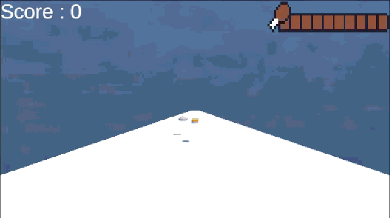
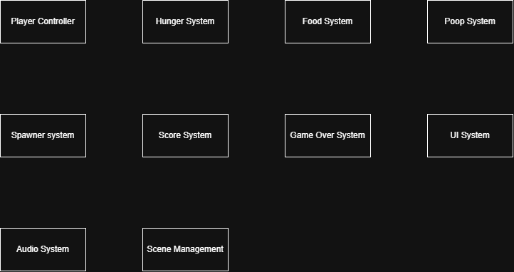

# 🍔 Hunger Run

  

---

# 📖 About the Game

**Hunger Run** is a 3D endless runner game developed using Unity and C#. Players must collect food to maintain their hunger level while avoiding poop obstacles along the track.

Collecting food restores hunger, while colliding with poop reduces the hunger level. Players must manage their hunger carefully and avoid obstacles to survive as long as possible.

---

# 🎮 Gameplay

The player automatically moves forward along an endless track while collecting food and avoiding poop obstacles.

Food: Restores the player's hunger level.
Poop: Reduces the player's hunger level upon collision.
Hunger Management: The hunger level continuously decreases over time. If it reaches zero, the game ends.

The objective is to maintain hunger, avoid poop, and achieve the highest possible score.

---

# 👥 Team

| Name      | Role            |
| --------- | --------------- |
| Christopher Immanuel Sunjoto | Game Programmer, Game Designer |

### My Contribution

* Developed the player controller and movement system
* Implemented automatic forward movement
* Created the hunger system
* Implemented food collection mechanics
* Implemented obstacle interactions
* Developed the spawning system for food and obstacles
* Created the score system
* Implemented the game-over and retry mechanics
* Integrated background music and sound effects
* Implemented scene transitions
* Implemented assets from itch io

---

# ✨ Features

* 3D Endless Runner Gameplay
* Automatic Forward Movement
* Player Side Movement
* Hunger Management System
* Food Collection System
* Poop Obstacles that Reduce Hunger
* Dynamic Food and Obstacle Spawning
* Score System
* Increasing Game Difficulty
* Game Over System
* Retry and Main Menu Navigation
* Background Music and Sound Effects

---

# ⚙️ Module Design

  

---

# ⚙️ Module and Features

| Module                | Features           | Description                                                              |
| --------------------- | ------------------ | ------------------------------------------------------------------------ |
| **Player Controller** | Movement, Input    | Handles player movement, forward progression, and horizontal movement    |
| **Hunger System**     | Hunger, UI         | Tracks the player's hunger level and updates the hunger indicator        |
| **Food System**       | Food Collection    | Restores hunger when the player collects food                            |
| **Poop System**   | Collision, Hunger Reduction  | Reduces the player's hunger when colliding with poop                       |
| **Spawner System**    | Food, Obstacles    | Spawns food and obstacles along the track                                |
| **Score System**      | Score Tracking     | Tracks the player's score during gameplay                                |
| **Game Over System**  | Failure, Retry     | Handles game-over conditions and allows the player to retry              |
| **UI System**         | HUD, Buttons       | Displays score, hunger status, and gameplay controls                     |
| **Audio System**      | BGM, SFX           | Manages background music and sound effects                               |
| **Scene Management**  | Scene Transitions  | Handles navigation between the main menu, gameplay, and game-over scenes |

---

# 📁 Game Flow

  

---

# 🛠️ Development

* **Engine:** Unity
* **Programming Language:** C#
* **Genre:** Endless Runner · 3D · Arcade
* **Platform:** PC

---

# 💻 My Role

As the **Game Programmer**, I was responsible for implementing the core gameplay mechanics and systems.

### Programming Responsibilities

* Player movement and controls
* Hunger management and hunger UI
* Food collection and obstacle interactions
* Procedural spawning logic
* Score tracking
* Game-over conditions
* Scene management
* UI functionality
* Audio integration

### Game Design Responsibilities

* Designed the core endless runner gameplay loop
* Designed the hunger management mechanic
* Established the interaction between food collection and poop obstacles
* Designed the risk-and-reward gameplay of collecting food while avoiding poop
* Designed the scoring and survival objectives
* Worked on gameplay balancing to create a challenging experience

